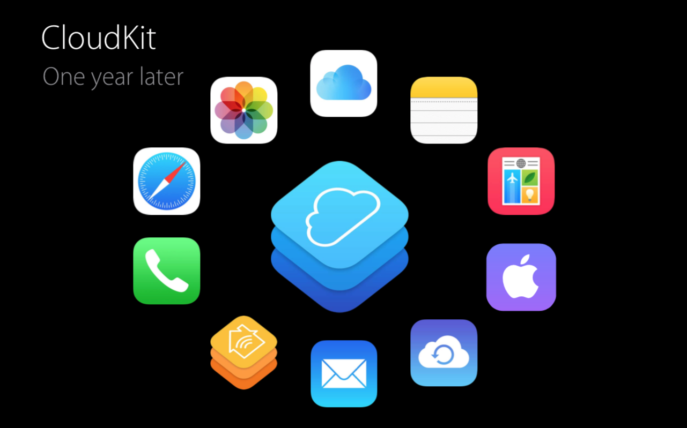
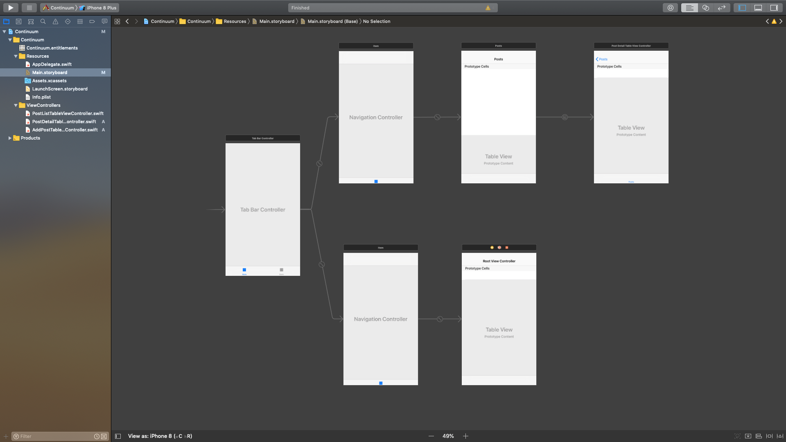
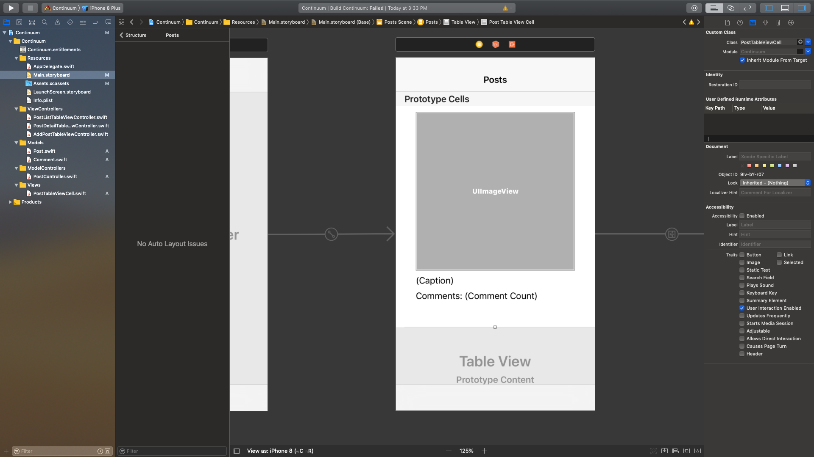
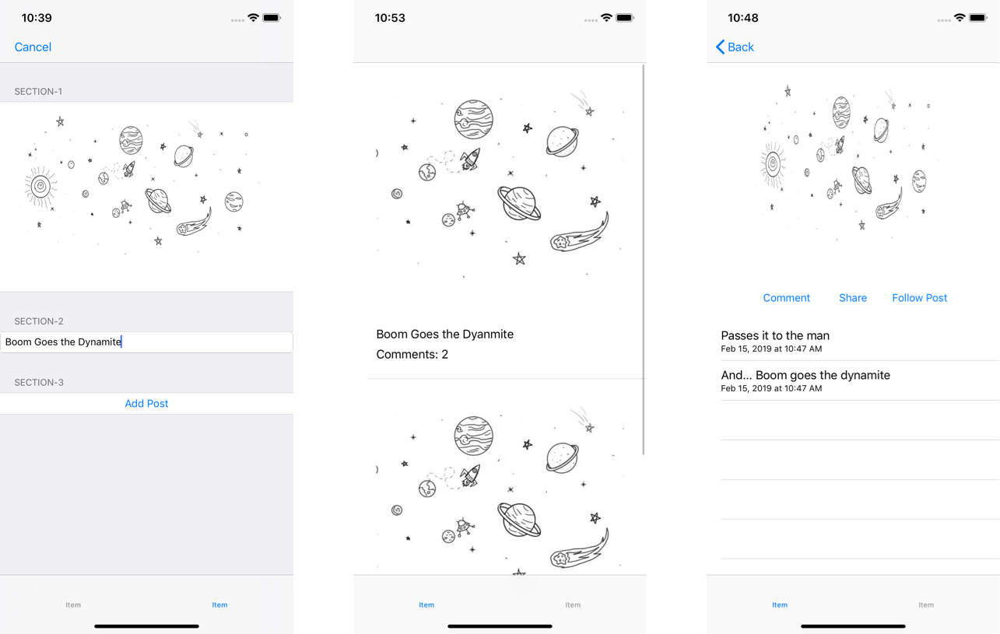
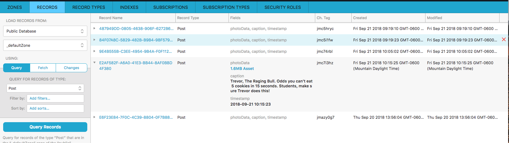

# Continuum
Continuum is a simple photo sharing service. Students will bring in many concepts that they have learned, and add more complex data modeling, Image Picker, CloudKit, and protocol-oriented programming to make a Capstone Level project spanning multiple days and concepts.

Most concepts will be covered during class, others are introduced during the project. Not every instruction will outline each line of code to write, but lead the student to the solution.

Students who complete this project independently are able to:

#### Part One - Project Planning, Model Objects, and Controllers

* follow a project planning framework to build a development plan
* follow a project planning framework to prioritize and manage project progress
* implement basic data model
* use staged data to prototype features

#### Part Two - Apple View Controllers, Search Controller, Container Views

* implement search using the system search controller
* use the image picker controller and activity controller
* use container views to abstract shared functionality into a single view controller

#### Part Three - Basic CloudKit: CloudKitManager,

* Check CloudKit availability
* Save data to CloudKit
* Fetch data from CloudKit
* Query data from CloudKit

#### Part Four - Intermediate CloudKit: Subscriptions, Push Notifications, Automatic Sync

* use subscriptions to generate push notifications
* use push notifications to run a push based sync engine

## Why CloudKit?
If you were in an interview and a developer asked you why you chose to use CloudKit, what would your answer be? "Because my mentors taught me", would be a lazy answer. Be confident with your decision to show you know what you're talking about. My reasons below would be as follows.

* CloudKit is native to Xcode and iOS development. You don't have to download anything. It forces you to become a better Apple programmer by following their conventions and design principles.
* Its free!
* It provides free iCloud user authentication.
* Apple-level privacy protection.
* It comes with a wealth of good resources, from Apple Programming Guides, WWDC videos on cloudKit best practices, and documentation.

All of these apps use cloudKit. Millions of users make use of these app every day. Beyond this, the concepts you'll learn when working with CloudKit will apply to almost any backend you use throughout your career.



## Part One - Project Planning, Model Objects, and Controllers
* follow a project planning framework to build a development plan
* follow a project planning framework to prioritize and manage project progress
* implement basic data model
* use staged data to prototype features

Follow the development plan included with the project to build out the basic view hierarchy, basic implementation of local model objects, model object controllers, and helper classes. Build staged data to lay a strong foundation for the rest of the app.

### Getting Started
1. Fork and Clone the starter project from the [Devmountain Github Project](https://github.com/DevMountain/Continuum)
2. Create your own new local “starter” branch and pull the remote starter branch
`git checkout -b starter`
`git pull origin starter`
3. Branch from starter to your own local develop branch you can begin to code on
`git checkout -b develop`

### View Hierarchy
Implement the view hierarchy in Storyboards. The app will have a tab bar controller as the initial controller. The tab bar controller will have two tabs.

The first is a navigation controller that has a PostListTableViewController that will display the list of posts, and will also use a UISearchBar to display search results. The PostListTableViewController will display a list of `Post` objects and segue to a `Post` detail view.

The second tab is a separate navigation controller that will hold a view controller to add new posts.

1. Add a `UITabBarController` as the initial viewController of the storyboard.  Delete both of the view controller that are attached to the Tab Bar Controller when you drag it out.
2. Add a `UITableViewController` Timeline scene, embed it in a `UINavigationController`, Make the navigation controller your first tab in the tab bar controller. (hint: control + drag from the tab bar controller to the navigation controller and select "view controllers" under the "Relationship Segue" section in the contextual menu)
3. Make the `UITableViewController` from step 1 a `PostListTableViewController` Cocoa Touch file subclass of `UITableViewController` and assign the subclass to the storyboard scene
4. Add a `UITableViewController` Post Detail scene, add a segue to it from the prototype cell of `PostListTableViewController` scene
5. Create a `PostDetailTableViewController` Cocoa Touch subclass of `UITableViewController` and assign it to the Post Detail scene
6. Add a `UITableViewController` Add Post scene, embed it into a `UINavigationController`. Make this navigation controller your second tab in the tab bar controller.
7. Add a `AddPostTableViewController`  Cocoa Touch subclass of `UITableViewController` and assign it to the Add Post scene

Your Storyboard should be simple skeleton resembling the set up below:



### Implement Model
Continuum will use a simple, non-persistent data model to locally represent data stored on CloudKit.

Start by creating model objects. You will want to save `Post` objects that hold the image data, and `Comment` objects that hold text. A `Post` should own an array of `Comment` objects.

#### Post
Create a `Post` model object that will hold image data and comments.

1. Add a new `Post` class to your project.
2. Add a `photoData` property of type `Data?`, a `timestamp` `Date` property, a `caption` of type `String`, and a `comments` property of type `[Comment]`. *You will get a “undeclared type” error as we have not cerated the* `Comment` *model object. Ignore this for now*
3. Add a computed property, `photo` with a getter which returns a `UIImage` initialized using the data in `photoData` and a setter which adjusts the value of the `photoData` property to match that of the `newValue` for UIImage.  *Notice, the initalizer for `UIImage(data: )` is failable and will return an optional UIImage and that `newValue.jpegData(compressionQuality: )` optional data.  You will need to handle these optionals by making `photoData` and `photo` optional properties.*

<details closed>
	<summary><strong>Computed Photo Property</strong></summary>
	<br>

```swift
var photo: UIImage?{
    get{
        guard let photoData = photoData else {return nil}
        return UIImage(data: photoData)
    }
    set{
        photoData = newValue?.jpegData(compressionQuality: 0.5)
    }
}
```

</details>

<p></p>

4. Add an initializer that accepts a photo, caption, timestamp,  and comments array. Provide a default values for the `timestamp` argument equal to the current date i.e. `Date()` and a default value for the `comments` of an empty array.
*Because* `photo` *is a computed property, you may get this error:*

*You can solve this by moving the initialization of* `photo` *i.e.* `self.photo = photo` *to the last line of the initalizer.*

#### Comment
Create a `Comment` model object that will hold user-submitted text comments for a specific `Post`.

1. Add a new `Comment` class to your project.
2. Add a `text` property of type `String`, a `timestamp` `Date` property, and a weak `post` property of type `Post?`.
* The comment objects reference to the post object should be weak in order to avoid retain cycles later on.
`weak var post: Post?`
3. Add an initializer that accepts text, timestamp, and a post. Provide a default values for the `timestamp` argument equal to the current date, so it can be omitted if desired.

### Model Object Controller
Add and implement the `PostController` class that will be used for CRUD operations.

1. Add a new `PostController` class file.
2. Add a `shared` singleton property.
3. Add a `posts` property initialized as an empty array.
4. Add an `addComment` function that takes a `text` parameter as a `String`,  a `Post` parameter, and a closure which takes in a `Comment` and returns Void.
* *For now this function will only initialize a new comment and append it to the given post's comments array. The completion will be used when CloudKit is implemented*
5. Add a `createPostWith` function that takes an image parameter as a `UIImage`, a caption as a `String`, and a closure which takes in a `Post?` and returns `Void`.
6. The function will need to initialize a post from the image and new comment and append the post to the `PostController`s  `posts` property (think source of truth).  *The completion handler will be utilized with CloudKit integration*

*Note: These CRUD functions will only work locally right now.  We will integrate Cloudkit further along in the project*

### Wire Up Views

#### Timeline Scene - Post List Table View Controller
Implement the Post List Table View Controller. You will use a similar cell to display posts in multiple scenes in your application. Create a custom `PostTableViewCell` that can be reused in different scenes.

1. Implement the scene in Interface Builder by creating a custom cell with an image view that fills most of the cell, a label for the posts caption, and another label for displaying the number of comments a post has.  With the caption label selected, turn the number of lines down to 0 to enable this label to spread to the necessary number of text lines.  Constrain the UI elements appropriately.  Your `PostTableViewCell` should look similar to the one below.




2. Create a `PostTableViewCell` class, subclass the table view cell from the previous step in your storyboard and add the appropriate IBOutlets.
3. In your `PostTableViewCell` add a `post` variable, and implement an `updateViews` function to the `PostTableViewCell` to update the image view with the post’s `photo`, and each of the labels with the relevant information from the post. Call the function in the didSet of the `post` variable
4. Keeping with the aesthetic of our favorite original photo sharing application, give the imageView an aspect ratio of 1:1.  You will want to do this for all Post Image Views within the app to maintain consistency.  Place a sample photo in your storyboard and explore the options of `Aspect Fill`, `Aspect Fit` and `Scale to Fill`.  The master project will be using `Aspect Fill` with `Clips to Bounds` On.
5. Implement the `UITableViewDataSource` functions for the `PostListTableVIewController`.  Use the source of truth from the `PostController` to populate the tableView.
6. Implement the `prepare(for segue: ...)` function to check the segue identifier, capture the detail view controller, index path, selected post, and assign the selected post to the detail view controller.
	* note: You will need to add an optional  `post` property to the `PostDetailTableViewController`.

#### Post Detail Scene
Implement the Post Detail View Controller. This scene will be used for viewing post images and comments. Users will also have the option to add a comment, share the image, or follow the user that created the post.

Use the table view's header view to display the photo and a toolbar that allows the user to comment, share, or follow. Use the table view cells to display comments.

1. Add a UIView to the header of the `PostDetailTableViewController`
2. Add a vertical `UIStackView` to the Header of the table view. Add a `UIImageView` and a horizontal `UIStackView` to the stack view. Add 'Comment', 'Share', and 'Follow Post' `UIButtons`s to the horizontal stack view. Set the horizontal stack view to have a center alignment and Fill Equally distribution.  Set the Vertical Stack View to have Fill alignment and Fill distribution.
3. Constrain the image view to an aspect ratio of 1:1
4. Constrain the vertical Stack View to be centered horizontally and vertically in the header view and equal to 80% of the height of the header view (i.e. the users screen width). 
5. In  `PostDetailTableViewController.swift` create an IBOutlet from the Image View named `photoImageView` and connect IBActions from each button.
6. The cells of this tableView should support comments that span multiple lines without truncating them and a timestamp for each comment. Set the `UITableViewCell` to the subtitle style. Set the number of lines for the cells title label to zero.
7. Add an `updateViews` function that will update the scene with the details of the post. Implement the function by setting the `photoImageView.image` and reloading the table view.  Use a `didSet` on the `post` variable to call `updateViews`.
8. Implement the `UITableViewDataSource` functions to populate the tableView with the post’s array of comments.
9. In the IBAction for the 'Comment' button. Implement the IBAction by presenting a `UIAlertController` with a text field, a Cancel action, and an 'OK' action. Implement the 'OK' action to initialize a new `Comment` via the `PostController` and reload the table view to display it.  Leave the completion closure in the `addComment` function blank for now.
	* note: Do not create a new `Comment` if the user has not added text.
*Leave the Share and Follow button IBActions empty for now.  You will fill in implementations later in the project.*

#### Add Post Scenes
Implement the Add Post Table View Controller. You will use a static table view to create a simple form for adding a new post. Use three sections for the form:

Section 1: Large button to select an image, and a `UIImageView` to display the selected image
Section 2: Caption text field
Section 3: Add Post button

Until you implement the `UIImagePickerController`, you will use a staged static image to add new posts.

1. In the the attributes inspector of the `AddPostTableViewController`, assign the table view to use static cells. Adopt the 'Grouped' cell style. Add three sections.
2. Build the first section by creating a tall image selection/preview cell. Add a 'Select Image' `UIButton` that fills the cell. Add an empty `UIImageView` that also fills the cell. Make sure that the button is on top of the image view so it can properly recognize tap events.
3. Build the second section by adding a `UITextField` that fills the cell. Assign placeholder text so the user recognizes what the text field is for.
4. Build the third section by adding a 'Add Post' `UIButton` that fills the cell.
5. Add an IBAction and IBOutlet to the 'Select Image' `UIButton` that assigns a static image to the image view (use the empty state space drawing in Assets.xcassets from the starter project for prototyping this feature), and removes the title text from the button.
	* note: It is important to remove the title text so that the user no longer sees that a button is there, but do not remove the entire button, that way the user can tap again to select a different image (i.e. do not hide the button).
6. Add an IBAction to the 'Add Post' `UIButton` that checks for an `image` and `caption`. If there is an `image` and a `caption`, use the `PostController` to create a new `Post`. Guard against either the image or a caption is missing.  Leave the completion closure in the `createPostWith` function empty for now.
7. After creating the post, you will want to navigate the user back to `PostListTableViewController` of the application.  You will need to edit the Selected View Controller for your apps tab bar controller.  You can achieve this by setting the `selectedIndex` property on the tab bar controller.

`self.tabBarController?.selectedIndex = 0`

8. Add a 'Cancel' `UIBarButtonItem` as the left bar button item. Implement the IBAction to bring the user back to the `PostListTableViewController` using the same line of code from the previous step.
9. Override `ViewDidDisappear` to reset the Select Image Button's title back to "Select Image”, reset the imageView's image to nil, and remove the any text from the caption textField.
10. Navigate back to the `PostListTableViewController` .  Override `viewWillAppear` to reload the tableView.

#### A Note on Reusable Code
Consider that this Photo Selection functionality could be useful in different views and in different applications. New developers will be tempted to copy and paste the functionality wherever it is needed. That amount of repetition should give you pause. *Don't repeat yourself* (DRY) is a shared value among skilled software developers.

Avoiding repetition is an important way to become a better developer and maintain sanity when building larger applications.

Imagine a scenario where you have three classes with similar functionality. Each time you fix a bug or add a feature to any of those classes, you must go and repeat that in all three places. This commonly leads to differences, which leads to bugs.

You will refactor the Photo Selection functionality (selecting and assigning an image) into a reusable child view controller in Part 2.

### Polish Rough Edges
At this point you should be able view added post images in the Timeline Post List scene, add new `Post` objects from the Add Post Scene, add new `Comment` objects from the Post Detail Scene.  Your app will not persist or share data yet.
Use the app and polish any rough edges. Check table view cell selection. Check text fields. Check proper view hierarchy and navigation models.  You’re app should look similar to the screenshots below:



### Black Diamonds:
* Use a UIAlertController to present an error message to the User if they do not insert a photo, or caption when trying to create a post.
* Refactor the code from the first black diamond to present a similar alert if a user tries to create a comment without any text.  Do not repeat the code for creating a UIAlertController.

## Part Two - UISearchBarDelegate, UIImagePickerController

* implement search using UISearchBarDelegate
* use the image picker controller and activity controller

Add and implement search functionality to the search view. Implement the Image Picker Controller on the Add Post scene.

### Search Controller
Build functionality that will allow the user to search for posts with comments that have specific text in them. For example, if a user creates a `Post` with a photo of a waterfall, and there are comments that mention the waterfall, the user should be able to search the Timeline view for the term 'water' and filter down to that post (and any others with water in the comments).

#### Update the Model
Add a `SearchableRecord` protocol that requires a `matchesSearchTerm` function. Update the `Post` and `Comment` objects to conform to the protocol.

1. Add a new `SearchableRecord.swift` file.
2. Define a `SearchableRecord` protocol with a required `matches(searchTerm: String)` function that takes a `searchTerm` parameter as a `String` and returns a `Bool`.

Consider how each model object will match to a specific search term. What searchable text is there on a `Comment`? What searchable text is there on a `Post`?

3. Update the `Comment` class to conform to the `SearchableRecord` protocol. Return `true` if `text` contains the search term, otherwise return `false`.
4. Update the `Post` class to conform to the `SearchableRecord` protocol. Return `true` if any of the `Post` `comments`  or its `caption` match the search term , otherwise return `false`.

You can use a Playground to test your `SearchableRecord` and `matches(searchTerm: String)` functionality and understand what you are implementing.

#### PostListTableViewController: UISearchBar & UISearchBarDelegate
Use a UISearchbar to allow a user to search through different posts for the given search text.  This will require the use of the of the `SearchableRecord` protocol and the each models implentation of the `matches(searchTerm: String)` function.  The `PostListTableViewController` will need to conform to the `UISearchBarDelegate` and implement the appropriate delegate method.

1. Add a `UISearchBar` to the headerView of the  `PostListTableViewController` scene in the main storyboard.  Check the `Shows Cancel Button` in the attributes inspector.  Create an IBOutlet from the search bar to the `PostListTableViewController` class.
2. Add a `resultsArray` property in the `PostListTableViewController` class that contains an array of `Post`
3. Add an `isSearching` property at the top of the class which stores a `Bool` value set to `false` by default
4. Created a computed property called `dataSource` as an array of `Post` Which will return the `resultsArray` if `isSearching` is `true` and the `PostController.shared.posts` if `isSearching` is `false`.

<details closed>
	<summary><strong>var dataSource: [SearchableRecord]</strong></summary>
	<br>
	
```swift
var dataSource: [SearchableRecord] {
    return isSearching ? resultsArray : PostController.shared.posts
  }
```
	
</details>

<p></p>

6. Refactor the `UITableViewDataSource` methods to populate the tableView with the new `dataSource` property.
7. In `ViewWillAppear` set the results array equal to the `PostController.shared.posts`.
8. Adopt the UISearchBarDelegate protocol in an extension on `PostListTableViewController`, and implement the `searchBar(_:textDidChange:)` function.  Within the function filter `PostController.shared.posts` using the `Post` object's  `matches(searchTerm: String)` function and setting the `resultsArray` equal to the results of the filter.  Call `tableView.reloadData()` at the end of this function.
9. Implement the `searchBarCancelButtonClicked(_ searchBar:)`  function, using it to set the results array equal to `PostController.shared.posts` then reload the table view.  You should also set the searchBar's text equal to an empty String and resign its first responder.  This will return the feed back to its normal state of displaying all posts when the user cancels a search.
10. Implement the `searchBarTextDidBeginEditing` and set `isSearching` to `true`.
11. Implement the `searchBarTextDidEndEditing` and set `isSearching` to `false`.
12. In `ViewDidLoad` set the Search Bar's delegate property equal to `self`

Add Several Posts with a variety of captions and comments.  Test whether you can successfully search the posts using the search bar.

### Image Picker Controller

#### Photo Select Child Scene
Implement the Image Picker Controller in place of the prototype functionality you built previously.

1. In the` AddPostTableViewController`, update the 'Select Image' IBAction to present an `UIAlertController` with an `actionSheet` style which will allow the user to select from picking an image in their photo library or directly from their camera.
2. Implement  `UIImagePickerController` to access the phones photo library or camera.  Check to make sure each `UIImagePickerController.SourceType` is available, and for each that is add the appropriate action to the `UIAlertController` above.
3. Implement the `UIImagePickerControllerDelegate` function to capture the selected image and assign it to the image view.
Please read through the documentation for [UIImagePickerController](https://developer.apple.com/documentation/uikit/uiimagepickercontroller) and its [delegate](https://developer.apple.com/documentation/uikit/uiimagepickercontrollerdelegate)
* note: Be sure to add a `NSCameraUsageDescription`  and `NSPhotoLibraryUsageDescription` to your apps `Info.plist` . These strings will be displayed in the Alert Controller apple presents to ask users for specific permissions.

You should now be able to select and initialize posts with the photos from your camera or photo library.  You will need to test the camera feature on an actual iPhone as the simulator does not support a camera.

### Reduce Code Repetition
Refactor the photo selection functionality from the Add Post scene into a child view controller.

Child view controllers control views that are a subview of another view controller. It is a great way to encapsulate functionality into one class that can be reused in multiple places. This is a great tool for any time you want a similar view to be present in multiple places.

In this instance, you will put 'Select Photo' button, the image view, and the code that presents and handles the `UIImagePickerController` into a `PhotoSelectorViewController` class. You will also define a protocol for the `PhotoSelectorViewController` class to communicate with it's parent view controller.

#### Container View and Embed Segues
Use a container view to embed a child view controller into the Add Post scene.

> A Container View defines a region within a view controller's view subgraph that can include a child view controller. Create an embed segue from the container view to the child view controller in the storyboard.  

1. Open `Main.storyboard` to your Add Post scene.
2. Add a new section to the static table view to build the Container View to embed the child view controller.
3. Search for Container View in the Object Library and add it to the newly created table view cell.
	* note: The Container View object will come with a view controller scene. You can use the included scene, or replace it with another scene. For now, use the included scene.
4. Set up constraints so that the Container View fills the entire cell.
5. Move or copy the Image View and 'Select Photo' button to the container view controller.
6. Create a new `PhotoSelectorViewController` file as a subclass of `UIViewController` and assign the class to the new embedded scene in Interface Builder.
7. Create the necessary IBOutlets and IBActions, and migrate your Photo Picker code from the Add Post view controller class. Delete the old code from the Add Post view controller class.  Check for any broken or duplicate outlets in your Interface Builder scenes.

You now have a container view which can be referenced and reused throughout your app.  In this version of the app, we will only use the scene once, but the principle remains.

#### Child View Controller Delegate
Your child view controller needs a way to communicate events to it's parent view controller. This is most commonly done through delegation. Define a child view controller delegate, adopt it in the parent view controller, and set up the relationship via the embed segue.

1. Define a new `PhotoSelectorViewControllerDelegate` protocol in the `PhotoSelectorViewController` file with a required `photoSelectorViewControllerSelected(image: UIImage)` function that takes a `UIImage` parameter to pass the image that was selected.
	* note: This function will tell the assigned delegate (the parent view controller, in this example) what image the user selected.
2. Add a weak optional delegate property to the `PhotoSelectorViewController`.
3. Call the delegate function in the `didFinishPickingMediaWithInfo` function, passing the selected media to the delegate.
4. Adopt the `PhotoSelectViewControllerDelegate` protocol in the `AddPostTableViewController`, implement the `photoSelectViewControllerSelectedImage` function to capture a reference to the selected image.
	* note: In the `AddPostTableViewController` scene, you will use that captured reference to create a new post.

Note the use of the delegate pattern. You have encapsulated the Photo Selection workflow in one class, but by implementing the delegate pattern,  each parent view controller can implement its own response to when a photo was selected.

You have declared a protocol, adopted the protocol, but you now must assign the delegate property on the instance of the child view controller so that the `PhotoSelectViewController` can communicate with its parent view controller. This is done by using the embed segue, which is called when the Container View is initialized from the Storyboard, which occurs when the view loads.

1. Assign a segue identifier to the embed segue in the Storyboard file
2. Implement the `prepare(forSegue: ...)` function in the `AddPostTableViewController` to check for the segue identifier, capture the `destinationViewController` as a `PhotoSelectorViewController`, and assign `self` as the child view controller's delegate.

### Post Detail View Controller Share Sheet
Use the `UIActivityController` class to present a share sheet from the Post Detail view. Share the image and the text of the first comment.

1. Add an IBAction from the Share button in your `PostDetailTableViewController` if you have not already.
2. Initialize a `UIActivityViewController` with the `Post`'s image and the caption as the shareable objects.
3. Present the `UIActivityViewController`.

### Black Diamond:

* Some apps will save photos taken or processed in their app in a custom Album in the user's Camera Roll. Add this feature to the `AddPostTableViewController` so that when a user adds a photo to the app, it saves to a “Continuum” album in their photo library.

## Part Three - Basic CloudKit
* Check CloudKit availability
* Save data to CloudKit
* Fetch data from CloudKit

Following some of the best practices in the CloudKit documentation, add CloudKit to your project as a backend syncing engine for posts and comments. Check for CloudKit availability, save new posts and comments to CloudKit, and fetch posts and comments from CloudKit.

When you finish this part, the app will support syncing photos, posts, and comments from the device to CloudKit, and pulling new photos, posts, and comments from CloudKit.   You will implement push notifications, subscriptions, and basic automatic sync functionality in Part Four.

### Update Post for CloudKit functionality

1. Import CloudKit in the `Post.swift` file
2. Add a recordID property to your `Post` class of type `CKRecord.ID` .  Update the Post initializer to take in a `CKRecord.ID` with a default value of `CKRecord.ID(recordName: UUID().uuidString)`
3. To save your photo to CloudKit, it must be stored as a `CKAsset`. `CKAsset`s must be initialized with a file path URL. In order to accomplish this, you need to create a temporary directory that copies the contents of the `photoData: Data?` property to a file in a temporary directory and returns the URL to the file. This is going to be a 2 step process.
* 3.1. Save the image temporarily to disk
* 3.2. Create the CKAsset

<details closed>
	<summary><strong>var imageAsset: CKAsset?</strong></summary>
	<br>

```swift
    var imageAsset: CKAsset? {
        get {
            let tempDirectory = NSTemporaryDirectory()
            let tempDirecotryURL = URL(fileURLWithPath: tempDirectory)
            let fileURL = tempDirecotryURL.appendingPathComponent(UUID().uuidString).appendingPathExtension("jpg")
            do {
                try photoData?.write(to: fileURL)
            } catch let error {
                print("Error writing to temp url \(error) \(error.localizedDescription)")
            }
            return CKAsset(fileURL: fileURL)
        }
    }
```

</details>

<p></p>

The whole point of the above computed property is to read and write for our photo property. Look up `CKAsset`, it can only take a fileURL. 

3. We will need a way of converting local `Post` objects into a type which can be saved to CloudKit (i.e. CKRecords).  To achieve this, we will extend CloudKit’s `CKRecord` class and add a  convenience initializer which takes in a single `Post` instance.
	* Initialize a `CKRecord` with recordType of “Post” and recordID of the post’s recordID property.
	* Set the values of the CKRecord with the post’s properties.  CloudKit only supports saving Foundational Types (save dictionaries) and will not allow saving `UIImage` or `Comment` instances.  We will therefore need to save a `CKAsset` instead of an image.  We will ignore comments for now, and come back to them using a process called back referencing.
	* *Note: Setting the values of this glorified dictionary will require many 	hardcoded string which can lead to typo errors especially in larger projects.  Consider creating a constants struct to hold each of these string values.*
	
<details closed>
	<summary><strong>CKRecord Extension</strong></summary>
	<br>
	
```swift
extension CKRecord {
  convenience init?(post: Post) {
    self.init(recordType: PostConstants.typeKey, recordID: post.recordID)
    self.setValue(post.caption, forKey: PostConstants.captionKey)
    self.setValue(post.timestamp, forKey: PostConstants.timestampKey)
    self.setValue(post.imageAsset, forKey: PostConstants.photoKey)
  }
}
```

```swift
struct PostConstants {
  static let typeKey = "Post"
  static let captionKey = "caption"
  static let timestampKey = "timestamp"
  static let commentsKey = "comments"
  static let photoKey = "photo"
}
```

</details>

<div></div>

1. Add a failable initializer to `Post` which takes in a CKRecord.  
	* Remember, a CKRecord is little more than a glorified dictionary.  Pull all of the necessary values out of the CKRecord, casting and unwrapping them as necessary, then call the original designated initializer you edited in the previous step
	* You will need to first get the CKAsset back from the CKRecord then use its `fileURL` property to initialize `Data`
	* Remember to initialize the posts recordID property with the ckRecord’s recordID.
	* We will initialize comments with an empty array for now.
	* *Note: The strings you use to pull values out of the CKRecord will need to exactly match their respective strings in your CKRecord convenience initializer.  If you failed to implement in constant struct in the previous step, please reconsider your decision, and use that same constant struct here*  

### Update Comment for CloudKit Functionality
Make the same structural adjustments for you Comment model object to integrate it with CloudKit.  
Extend CKRecord to add a convenience initializer which takes in a Comment.    Write a failable initializer for your Comment which takes in  a CKRecord.

1. Add A CKRecord.ID property to the ‘Comment’ model.
2. Adjust your designated initializer to take in a CKRecord.ID with a default initializer value of a new CKRecord.ID initialized with the name of a new, unique uuid.
 `CKRecord.ID(recordName: UUID().uuidString)`
4. Extend CKRecord to add a convenience initializer which takes in a comment.  Initialize a new CKRecord using a recordType of “Comment” and the comment object’s recordID.  Set the values of the CKRecord to each of the comments properties.
* *Note: You should follow the same pattern of using a constants struct for referencing hard coded strings for CloudKit keys.*

#### A Note on Back Referencing
You will likely run into some issues as you try to save the comment’s post property to CloudKit.  You will not be able to set the value of a CKRecord as `Post` (CloudKit does not support saving custom types).  Rather we will need to use a strategy called back referencing to coordinate the relationship between posts and comments.  Rather than a comment, directly containing a post, a comment in CloudKit is going to maintain a reference to a Post.  You can think about this distinction as the difference between one webpage containing the entire contents of another web page vs containing a url link to that other webpage.  We will use the posts recordID property as our analogous “url” in this example.  

CloudKit contains a special class for creating references like this called `CKRecord.Reference`.  Please read through the documentation for `CKRecord.Reference` [here](https://developer.apple.com/documentation/cloudkit/ckrecord/reference) . Using a `CKRecord.Reference`  is preferable to just saving the post’s recordID as a string because CloudKit will then handle writing operations for us on the relationship.  For example, if I delete a post, a `CKRecord.Reference` may allow CloudKit to automatically delete all of its  associated comments.  

5. Add a computed property of types `CKRecord.Reference?` to the comment class.  This should return a new `CKRecord.Reference` using the comment’s post object

<details closed>
<summary><strong>var postReference: CKRecord.Reference</strong></summary>
	<br>

``` swift
 var postReference: CKRecord.Reference? {
    guard let post = post else { return nil }
    return CKRecord.Reference(recordID: post.recordID, action: .deleteSelf)
  }
```

</details>

<p></p>

6. Revisit your convenience initializer on `CKRecord` which takes in a comment and add the postReference to the record being created.
7. Add a failable convenience initializer on the `Comment` class which takes in a `CKRecord` and a `Post`.  Unwrap the necessary properties for a comment from the ckRecord and call the designated initializer we wrote earlier.

### Checking to see if the user is signed into iCloud
If the user isn't signed into their iCloud account, they will not be able to save or fetch data using CloudKit.  Most of the features wouldn't fully work. If they are not signed in, we want to let the user know immediately.  If they are signed into iCloud, we want the app to continue as usual. Take a moment and think about this, if the user is signed in 'do something' if the user isn't signed in 'do something else'. What would our function signature look like?  You will want to do this when the app first launches.

1. In the `AppDelegate`,  write a function to check the iCloud Account Status of a iPhone user.  
* The `default()` Singleton of the  `CKContainer` class has an `accountStatus` function that can check the users status. There are 4 options, for `CKAccountStatus` which you can read about [here](https://developer.apple.com/documentation/cloudkit/ckaccountstatus). 
2. In the completion of  `CKContainer.default().accountStatus`, write a switch statement based on the users status inside the closure where you can handle each case as necessary.  You will need a `@escaping` completion closure to handle the events if the user is signed in or not.  If the users account status is anything other than `.available`  we’ll need to call the completion passing in `false` and present an alert to notify the user that they are not signed in. 
*Note: In this case you will not use the completion of this function for anything more than a print statement; however, it is good practice to include an escaping completion for any function which makes asynchronous calls in order to give yourself or other developer using your code the opportunity to run code when the call has completed.*
	* Create an extension on UIView controller and add a function `presentSimpleAlertWith(title: String, message: String?)`. You'll call this function within your `checkAccountStatus(completion: @escaping (Bool) -> Void)` Based on the users status you'll provide the proper Error Message to inform the user.  *If you already completed the Black Diamond from Part 1 you will already have the code for this.*

	If you attempt to present an alert in this class, you'll notice an error. That's because `AppDelegate` isn't a subclass of `UIViewController` nor should it be. We don't have access to any `UIViewController` yet. 

	* Access the  `window.rootViewController` property of your AppDelegate.  This will give you access to your applications initial ViewController.  In our case that will be the TabBarController.  Since UITabBarController is a subclass of UIViewController, this object will have access to the `presentSimpleAlertWith(title: String, message: String?)` function we wrote on the extension of `UIViewController`.

3. Call this newly minted function in the `application(_ application: UIApplication, didFinishLaunchingWithOptions launchOptions: [UIApplication.LaunchOptionsKey: Any]?) -> Bool`  delegate method to check the user’s account status when the app is launched. 

Take a moment and try this on your own if you get stuck here is the code for the AppDelegate and Extension of UIViewController.

<details closed>
<summary><strong>I swear I spent 10 minutes on my own before clicking this button</strong></summary>
	
```swift
import UIKit
import CloudKit

@UIApplicationMain
class AppDelegate: UIResponder, UIApplicationDelegate {

  var window: UIWindow?

  func application(_ application: UIApplication, didFinishLaunchingWithOptions launchOptions: [UIApplication.LaunchOptionsKey: Any]?) -> Bool {
    checkAccountStatus { (success) in
      let fetchedUserStatment = success ? "Successfully retrieved a logged in user" : "Failed to retrieve a logged in user"
       print(fetchedUserStatment)
    }
    return true
  }

  func checkAccountStatus(completion: **@escaping** (Bool) -> Void) {
    CKContainer.default().accountStatus { (status, error) in
      if let error = error {
        print("Error checking accountStatus \(error) \(error.localizedDescription)")
        completion(false); return
      } else {
        DispatchQueue.main.async {
          let tabBarController = self.window?.rootViewController
          let errrorText = "Sign into iCloud in Settings"
          switch status {
          case .available:
            completion(true);
          case .noAccount:
            tabBarController?.presentSimpleAlertWith(title: errrorText, message: "No account found")
            completion(false)
          case .couldNotDetermine:
            tabBarController?.presentSimpleAlertWith(title: errrorText, message: "There was an unknown error fetching your iCloud Account")
            completion(false)
          case .restricted:
            tabBarController?.presentSimpleAlertWith(title: errrorText, message: "Your iCloud account is restricted")
            completion(false)
          }
        }
      }
    }
  }
}

```
<div></div>
<p>*(In a Separate File)*</p>
<div></div>
```swift
extension UIViewController {
  func presentSimpleAlertWith(title: String, message: String?) {
    let alertController = UIAlertController(title: title, message: message, preferredStyle: .alert)
    let okayAction = UIAlertAction(title: "Okay", style: .cancel, handler: nil)
    alertController.addAction(okayAction)
    present(alertController, animated: true)
  }
}
```

</details>

<div></div>

## Update the Post Controller for CloudKit functionality
#### Saving Records
Update the `PostController` to support pushing and pulling data from CloudKit.

In order to enable the sharing functionality of this application, we will need to save Post and Comment Records to CloudKit’s public database.
`let publicDB = CKContainer.default().publicCloudDatabase`

1. Update the `createPost` function, using the convenience initializer we wrote on `CKRecord` to turn the post into a ckRecord. 

2.  Use CloudKit’s `save(_:completionHandler:)` function which you can read more about [here](https://developer.apple.com/documentation/cloudkit/ckdatabase/1449114-save).  You will need to handle any errors and call the completion on your `createPostWith(photo:caption:completion:)` function inside the completionHandler of the save function.

At this point you should be able to save a post record and see it in your CloudKit dashboard. You dashboard should look similar to this.


2. Update the `addCommentToPost` function to to create a `CKRecord` using the convenience initializer which takes in a comment on  `CKRecord`.  
3. Again use  CloudKit’s `save(_:completionHandler:)` function to save the comment to the database.  If you are wondering where the documentation for that function went, it’s still [here](https://developer.apple.com/documentation/cloudkit/ckdatabase/1449114-save) (:  Handle any error thrown in the save function completion and call your own completion accordingly.

At this point, each new `Post` or `Comment` should be pushed to CloudKit when new instances are created from the Add Post or Post Detail scenes. 
*Note: The safest practice for calling your own completions here is to unwrap the record passed back by CloudKit’s save completion, then initialize a Post or Comment  respectively, and complete with that object.* 

#### Fetching Records
There are a number of approaches you could take to fetching new records. For Continuum, we will simply be fetching (or re-fetching, after the initial fetch) all the posts at once. Note that while we are doing it in this project, it is not an optimal solution. We are doing it here so you can master the basics of CloudKit first.

##### Fetching Posts

1. Add a `fetchPosts` function that has a completion closure which takes in an array of optional `[Post]?` 's and returns `Void`.
2. Use the `publicDB`  property to [perform a query.](https://developer.apple.com/documentation/cloudkit/ckdatabase/1449127-perform) 
3. We will need to make a `CKQuery` and a `NSPredicate`. The predicate value will be set to true which means it will fetch every post.
4. Handle any errors that may have been passed back, unwrap the records, and `compactMap` across the array of records calling your failable initializer  `init?(record: CKRecord)` on each one.  This will return a new array of posts fetched from our publicDB.
5. Don't forget to set your local array to the new array of posts. This is how the TVC will populate all our posts. And call completion.

##### Fetching Comments
We're going to create a function that will allow us to fetch all the comments for a specific post we give it.

1. Add a `fetchComments(for post: Post, ...)` function that has a completion closure which takes in an optional array of comments `[Comment]?` and returns `Void`.
2. Call your `publicDB` to perform a query for all the comments for the given post.
* Because we don't want to fetch every comment ever created, we must use a different `NSPredicate` then the default one. Create a predicate that checks the value of the correct field that corresponds to the post `CKReference` on the Comment record against the `CKReference` you created in the previous step.
4. Add a second predicate to includes all of the commentID's that have NOT been fetched.

<details closed>
	<summmary><strong> Fetching Comments Query </strong></summary>
	<br>
```swift 
    let postRefence = post.recordID
    let predicate = NSPredicate(format: "%K == %@", CommentConstants.postReferenceKey, postRefence)
    let commentIDs = post.comments.compactMap({$0.recordID})
    let predicate2 = NSPredicate(format: "NOT(recordID IN %@)", commentIDs)
    let compoundPredicate = NSCompoundPredicate(andPredicateWithSubpredicates: [predicate, predicate2]
    let query = CKQuery(recordType: "Comment", predicate: compoundPredicate) 
```

</details>

<div></div>

5. In the completion closure of the perform(query) , follow the common pattern of checking for errors, making sure the records exist, then create an array of comments using the array of records.
6. Append the contents of the newly created array of comments to the posts comments array.
7. Call your completion and pass in the comments which were fetched.

### Fetching Data for the PostListTableVIewController

1. In the `PostListTableViewController` add a new function to request a full sync operation that takes an optional completion closure. Implement the function by turning on the network activity indicator, calling the `fetchPosts` function on the `PostController`.  Reload the tableView and turn the network activity indicator off in the completion.
2. Call the function in the `viewDidLoad` lifecycle function to initiate a full sync when the user first opens the application.

4. In `viewDidLoad()`, start observing the `PostController.PostsChangedNotification`. In your observation method, reload the table view.

### Restructuring the Post Model to Optimize Fetch Times
You may have noticed that it takes a long time to fetch the results from CloudKit.  Moreover, there is a major bug.  Post objects, when they are initially fetched from CloudKit will display a comment count of 0 in the PostListTableViewController.  In order to display these with our current app structure, we would need to fetch all of the post, then for each post, go fetch all of its comments.  This is a heavy ask for CloudKit and could hang out UI fairly quickly.  Meanwhile we don’t even need the data for those comments until a user clicks into the detail view for post.  We will need to refactor our `Post` model to keep track of how many comments it has, and delay the fetching of comments until a user click on the detail page for a post.

1. Add a commentCount variable to the `Post` class
2. Adjust the `Post` initializers and the convenience  initializer on CKRecord which takes in a post. 
3. Add functionality to the `PostController`’s `addComment` function to increment the post’s commentCount by 1.  Make sure you update the value of this integer in CloudKit.  You will need to use the [CKModifyRecordsOperation](https://developer.apple.com/documentation/cloudkit/ckmodifyrecordsoperation/1447486-modifyrecordscompletionblock) class to do this.
4. Adjust the `PostTableViewCell` to populate the comment count label with this new property.

*Note: Changing our model in this way will make any old* `Post` *objects saved in the database incompatible with our new setup.  Clear your database to avoid any stagnant old data.*

#### Update the Post Detail Table View Controller

1. In `viewDidLoad()` of the `PostDetailTableViewController` call 
2. 
3. start observing the `PostController.PostCommentsChangedNotification`.
4. In your observation method, check that the notification's object is the post whose detail is being displayed, and if so, reload the table view.

#### Check Functionality
At this point the app should support basic push and fetch syncing from CloudKit. Use your Simulator and your Device to create new `Post` and `Comment` objects. Check for and fix any bugs.


When you tap on a post cell it should bring you to the detailVC. The comments that belong to that post should be fetched.

## Part Four - Intermediate CloudKit: Subscriptions, Push Notifications
* Use subscriptions to generate push notifications

Implement Subscriptions and push notifications to create a simple automatic sync engine. Add support for subscribing to new `Post` records and for subscribing to new `Comment` records on followed `Posts`s. Request permission for remote notifications. Respond to remote notifications by initializing the new `Post` or `Comment` with the new data.

When you finish this part, the app will support sending push notification when new records are created in CloudKit. 

### PostController Subscription Based Sync
Update the `PostController` class to manage subscriptions for new posts and new comments on followed posts. Add functions for following and unfollowing individual posts.

When a user follows a `Post`, he or she will receive a push notification and automatic sync for new `Comment` records added to the followed `Post`.

#### Subscribe to New Posts
Create and save a subscription for all new `Post` records.

1. Add a function `subscribeToNewPosts` that takes an optional completion closure with  `Bool` and `Error?` parameters.
	* note: Use an identifier that describes that this subscription is for all posts.
2. Initialize a new CKQuerySubscription for the `recordType` of 'Post'.  Pass in a predicate object with it value set to `true`.
3. Save the subscription to the public database.  Handle any error which may be passed out of the completion handler and complete with true or false based on whether or not an error occurred while saving.
4. Call the `subscribeToNewPosts` in the initializer for the `PostController` so that each user is subscribed to new `Post` records saved to CloudKit.

#### Subscribe to New Comments
Create and save a subscription for all new `Comment` records that point to a given `Post`

1. Add a function `addSubscriptionTo(commentsForPost post: ...)` that takes a `Post` parameter and an optional completion closure which takes in a `Bool` and `Error` parameters.
2. Initialize a new NSPredicate formatted to search for all post references equal to the `recordID` property on the `Post` parameter from the function.
3. Initialize a new `CKQuerySubscription` with a record type of `Comment`, the predicate from above, a `subscriptionID` equal to the posts record name which can be accessed using `post.recordID.recordName`, with the `options` set to `CKQuerySubscription.Options.firesOnRecordCreation`
4. Initialize a new `CKSubscription.NotificationInfo` with an empty initializer.  You can then set the properties of `alertBody`, `shouldSendContentAvailable`, and `desiredKeys`.  Once you have adjusted these settings, set the `notificationInfo` property on the instance of `CKQuerySubscription` you initialized above.
5. Save the subscription you initialized and modified in the public database.  Check for an error in the ensuing completion handler.
* Please see the [CloudKit Programming Guide](https://developer.apple.com/library/archive/documentation/DataManagement/Conceptual/CloudKitQuickStart/SubscribingtoRecordChanges/SubscribingtoRecordChanges.html#//apple_ref/doc/uid/TP40014987-CH8-SW1) and [CKQuerySubscription Documentation](https://developer.apple.com/documentation/cloudkit/ckquerysubscription) for more detail.

#### Manage Post Comment Subscriptions
The Post Detail scene allows users to follow and unfollow new `Comment`s on a given `Post`. Add a function for removing a subscription, and another function that will toggle a subscription for a given `Post`.

1. Add a function `removeSubscriptionTo(commentsForPost post: ...)` that takes a `Post` parameter and an optional completion closure with `success` and `error` parameters.
2. Implement the function by calling `delete(withSubscriptionID: ...)` on the public data base. Handle the error which may be returned by the completion handler.  If there is no error complete with `true`.
	* note: Use the unique identifier you used to save the subscription above. Most likely this will be your unique `recordName` for the `Post`.
3. Add a function `checkSubscription(to post: ...)` that takes a `Post` parameter and an optional completion closure with a  `Bool` parameter.
4. Implement the function by fetching the subscription by calling `fetch(withSubscriptionID: ...)` passing in the unique `recordName` for the `Post`.  Handle any errors which may be generated in the completion handler.  If the `CKSubscription` is not equal to nil complete with `true`, else complete with `false`.

5. Add a function `toggleSubscriptionTo(commentsForPost post: ...)` that takes a `Post` parameter and an optional completion closure with `Bool`, and `Error` parameters.

6. Implement the function by calling the `checkForSubscription(to post:...)` function above.  If a subscription does not exist, subscribe the user to comments for a given post by calling the `addSubscriptionTo(commentsForPost post: ...)` ; if one does, cancel the subscription by calling  `removeSubscriptionTo(commentsForPost post: ...)`.


### Update User Interface
Update the Post Detail scene's `Follow Post` button to display the correct text based on the current user's subscription. Update the IBAction to toggle subscriptions for new comments on a `Post`.

1. Update the `updateViews` function to call the `checkSubscriptionTo(commentsForPost: ...)` on the `PostController` and set appropriate text for the button based on the response.  You will need to add an IBOutlet for the button if you have not already.
2. Implement the `Follow Post` button's IBAction to call the `toggleSubscriptionTo(commentsForPost: ...)` function on the `PostController` and update the `Follow Post` button's text based on the new subscription state.

### Add Permissions
Update the Info.plist to declare backgrounding support for responding to remote notifications. Request the user's permission to display remote notifications.

1. Go to the Project File. In the "capabilities" tab, turn on Push Notifications and Background Modes. Under Background Modes, check Remote Notifications.
2. Request the user's permission to display notifications in the `AppDelegate` `didFinishLaunchingWithOptions` function.
	* note: Use the `requestAuthorization` function that is a part of `UNUserNotificationCenter`.
3. Register the App to receive push notifications `application.registerForRemoteNotifications()`

#ios/READMES
